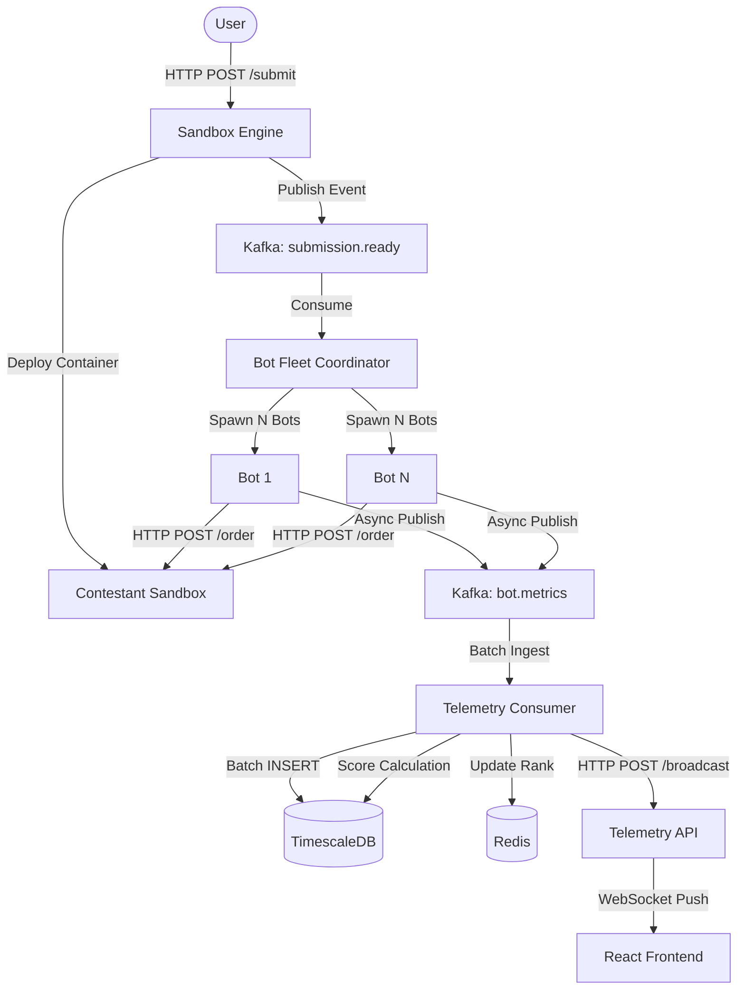

# Architecture Blueprint: Ranabhum

Event-driven benchmarking and real-time telemetry platform for high-throughput order matching engines.

---

## 1. System Topology



### Data Flow
1. Bot Fleet fires HTTP orders at the contestant sandbox, capturing nanosecond timestamps and round-trip latency per order.
2. Metrics are published asynchronously to Redpanda (`bot.metrics` topic).
3. Telemetry Consumer batches inserts into TimescaleDB, then runs aggregate scoring queries.
4. Final scores update the Redis sorted set and broadcast via WebSocket to the React leaderboard.

---

## 2. Technology Decisions

| Component | Choice | Rationale |
|-----------|--------|-----------|
| **Message Broker** | Redpanda (Kafka-compatible) | Decouples load generation from telemetry storage. Partitioning by `submission_id` ensures in-order event delivery per run. Avoids injecting DB write latency into the benchmarking hot path. |
| **Time-Series DB** | TimescaleDB (Postgres) | Hypertable auto-partitioning on `sent_at` optimizes high-frequency inserts. Native `percentile_cont` enables p50/p90/p99 calculations without application-level sorting. |
| **Leaderboard Cache** | Redis (AOF persistence) | Sorted Sets provide O(log N) rank updates and O(1) top-K reads. AOF persistence ensures rankings survive container restarts without full DB re-aggregation. |
| **Load Generator** | Go (goroutines) | Native concurrency primitives (goroutines + channels) achieve high fan-out with minimal memory overhead (~8KB per goroutine vs ~1MB per OS thread). Note: We mandate REST (`HTTP POST`) instead of FIX/WebSocket for this iteration to drastically reduce contestant onboarding friction during a hackathon. |
| **Sandbox Runtime** | Docker containers | Per-submission process isolation with cgroup resource limits. Language-specific multi-stage Dockerfiles (C++, Go, Rust) keep images minimal. |

---

## 3. Performance Engineering

### 3.1 Backpressure via Concurrency Semaphore
Each bot uses a buffered channel (`cap=100`) as a semaphore. The ticker acquires a slot before spawning a goroutine; the goroutine releases it on completion. If the contestant sandbox slows down, the semaphore fills and the ticker blocks, applying backpressure instead of unbounded goroutine/socket growth.

### 3.2 Async Kafka Writes
The Segmentio `kafka.Writer` is configured with `Async: true`. Metrics are buffered in-process and flushed to Redpanda in batches. This eliminates per-message network round-trips from the hot path; the bot runner never blocks on broker acknowledgement.

### 3.3 Database Connection Pooling
The telemetry consumer initializes an `asyncpg.create_pool(min_size=2, max_size=10)`. All write paths i.e., batch inserts and score aggregation, acquire connections from this pool. This supports concurrent run scoring without connection serialization.

### 3.4 Batch Inserts with Async-Safe Buffering
Messages are accumulated in a list buffer (`BATCH_SIZE=100`). On flush, the buffer is synchronously copied and cleared before any `await`, preventing new messages from being appended mid-write and then lost on `clear()`. The database insert is wrapped in `asyncio.shield()` to survive task cancellation.

### 3.5 Composite Index for Score Aggregation
```sql
CREATE INDEX idx_submission_run ON order_metrics (submission_id, run_id, sent_at DESC);
```
The scoring query filters on `submission_id` and `run_id`; a composite index eliminates full-table scans as historical runs accumulate.

### 3.6 Two-Phase Correctness Validation (Accuracy & FIFO)
To solve the "Observer Effect" in distributed systems (where concurrent load generation makes deterministic order sequencing impossible), we employ a **Two-Phase Benchmarking Strategy**:

1. **Certification Phase (Low-Concurrency):** Before the stress test begins, the Bot Fleet Coordinator runs a deterministic FIFO check. It injects a sequence of `BUY` orders at the same price separated by a strict time gap (default 20ms) to outpace network jitter. It then sweeps them with a single `SELL` market order. It expects the contestant's engine to return the exact sequence of UUIDs in a `matched_order_ids` JSON array. This runs multiple times to generate a statistical `certification_score`.
2. **Capacity Phase (Max-Throughput):** Once certified, the coordinator unleashes the asynchronous bot fleet to bombard the engine. Here, we validate **fill accuracy** (`ExpectedFillQty` vs `ActualFillQty`), but strict cross-node FIFO sequence validation is bypassed to allow maximum throughput.

*Extensibility:* The `matched_order_ids` field is optional. Engines that do not implement it skip the Certification Phase and are marked "Not Attempted," preserving backward compatibility while rewarding advanced implementations.

---

## 4. Security Model

### 4.1 Contestant Sandbox Isolation
Untrusted contestant code runs inside containers with zero-trust defaults:

| Flag | Purpose |
|------|---------|
| `--cap-drop ALL` | Strips all Linux capabilities; no raw sockets, no device mounts |
| `--security-opt no-new-privileges` | Blocks SUID/SGID privilege escalation |
| `--read-only` | Immutable root filesystem |
| `--pids-limit 64` | Fork-bomb mitigation |
| `--memory 512m` / `--cpus 2` | Hard resource cgroup quotas. *Note: We use CFS quotas (`--cpus`) rather than strict CPU pinning (`--cpuset-cpus`) to avoid core starvation and scheduling deadlocks on shared cloud node pools (e.g., GKE `e2-medium` nodes).* |

### 4.2 Upload & Build Guards
- **50MB upload limit** enforced at the application layer before disk write.
- **300-second build timeout** via `context.WithTimeout` on `docker build`, kills hanging or malicious Dockerfiles.
- Archive extraction uses `filepath.Base()` on all entry names, stripping directory traversal paths (Zip Slip mitigation).

### 4.3 Network Isolation
Contestant containers run on the default Docker bridge network with no access to internal service DNS. The sandbox engine proxies all order traffic through a reverse proxy endpoint, preventing direct contestant-to-infrastructure communication.

---

## 5. Cloud Deployment (Kubernetes / GKE)

### Docker-in-Docker Sidecar
On GKE, host Docker socket mounting is blocked by security policies. We run a DinD sidecar container alongside the sandbox engine pod. The engine connects to the sidecar via `127.0.0.1:2375`, keeping contestant container orchestration fully within the pod boundary.

### Infrastructure as Code
- **Terraform**: GKE Standard cluster with preemptible `e2-medium` nodes (privileged mode support, 70% cost reduction).
- **Kubernetes**: Cloud-agnostic manifests in `k8s/`; identical deployment on any conformant cluster.
- **Docker Compose**: Single-command local stack with environment variable interpolation from `.env`.
